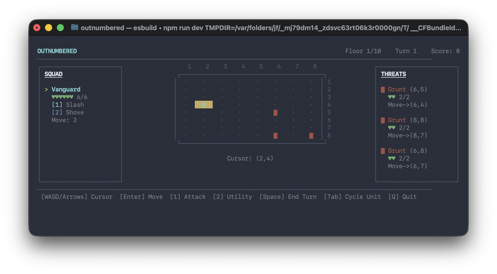

# Outnumbered

A tactical roguelike played entirely in the terminal. Lead a squad of three through 10 floors of increasingly dangerous enemies, making tough choices about positioning, abilities, and when to press your luck.

Built with [Ink](https://github.com/vadimdemedes/ink) (React for CLIs) and TypeScript.



## Install & Play

```bash
git clone https://github.com/sapochat/outnumbered.git
cd outnumbered
npm install
npm run dev
```

## How to Play

You control a squad of up to 3 units on an 8x8 grid. Enemies telegraph their moves — you see what they'll do before they do it. Clear all enemies to advance to the next floor.

### Controls

| Key | Action |
|-----|--------|
| `W/A/S/D` or arrows | Move cursor |
| `Tab` | Cycle between units |
| `M` | Move selected unit to cursor |
| `1` | Use attack ability on cursor target |
| `2` | Use utility ability on cursor target |
| `Space` | End turn |
| `Q` | Quit |

### Turn Flow

1. **Enemy Intent** — Enemies reveal what they plan to do (shown in the threat panel)
2. **Player Action** — Move your units and use abilities to counter
3. **Resolution** — Enemy actions execute, damage resolves

### Classes

| Class | HP | Move | Attack | Utility |
|-------|----|------|--------|---------|
| **Vanguard** | 6 | 2 | Slash (melee, 1 dmg) | Shove (push 2 tiles) |
| **Ranger** | 4 | 3 | Shoot (range 3, 1 dmg) | Pin (immobilize 1 turn) |
| **Arcanist** | 3 | 3 | Bolt (line AoE, 1 dmg) | Warp (teleport anywhere) |

### Enemies

| Enemy | Symbol | HP | Behavior |
|-------|--------|----|----------|
| Grunt | `▓` | 2 | Advances and melees for 1 dmg |
| Archer | `░` | 2 | Shoots in cardinal lines for 1 dmg |
| Spawner | `X` | 4 | Spawns a Grunt every 2 turns |
| Charger | `►` | 3 | Charges in a straight line for 2 dmg |
| Shield | `■` | 3 | Guards nearby allies, reducing incoming damage by 1 |

### Bosses

**Floor 5 — Warlord** `W` (10 HP)
- Melee for 2 damage
- War Cry every 3 turns — all Grunts deal double damage
- Enrages below 50% HP, moving twice as far

**Floor 10 — Hive Queen** `Q` (15 HP)
- Stationary, fires line attacks down cardinal directions
- Spawns Grunts periodically
- Phase 2 (below 50% HP): increased range, spawns every turn, cross AoE around your units

### Rewards

After clearing each floor, choose one of three rewards:

- **Heal** — Restore all units to full HP
- **+1 HP / +1 Move** — Permanent stat boost for a unit
- **New Attack / Utility** — Replace a unit's ability with a new one
- **Recruit** — Add a new unit to your squad (if below 3)

#### Learnable Abilities

| Ability | Slot | Effect |
|---------|------|--------|
| Cleave | Attack | Melee, 2 damage |
| Snipe | Attack | Range 5, 1 damage |
| Arc | Attack | Line AoE range 3, 1 damage |
| Heal | Utility | Restore 2 HP to adjacent ally |
| Dash | Utility | Move up to 4 tiles in a line |
| Stun | Utility | 1 damage + immobilize |

## Architecture

```
src/
├── game/           Pure game logic (zero UI dependencies)
│   ├── types.ts    Core types: Position, RunState, GamePhase
│   ├── engine.ts   Turn phase machine
│   ├── combat.ts   Ability execution & enemy intent resolution
│   ├── enemies.ts  Per-type enemy AI
│   ├── units.ts    Unit factory & mutations
│   └── grid.ts     Distance, adjacency, line-of-sight
├── data/           Static balance tables
│   ├── unit-defs.ts
│   ├── enemy-defs.ts
│   ├── floor-tables.ts
│   └── ability-pool.ts
├── ui/             Ink/React components
│   ├── app.tsx     Screen router (title/game/reward/game_over)
│   ├── game-screen.tsx
│   ├── grid-panel.tsx
│   ├── reward-screen.tsx
│   └── ...
└── state/          Persistence (~/.outnumbered/meta.json)
```

Game logic is fully separated from rendering — all state is immutable, all functions are pure. The UI layer calls game functions and stores results in React state.

## Testing

```bash
npm test              # run all tests
npm run test:watch    # watch mode
```

99 tests cover the game logic layer: grid math, unit/enemy factories, all enemy AI behaviors, combat resolution, and engine phase transitions.

## License

MIT
